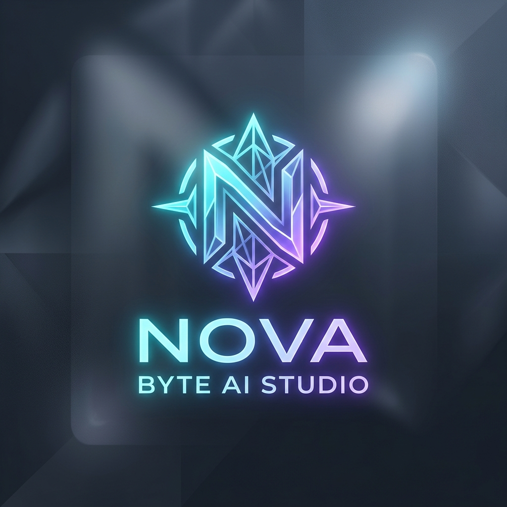
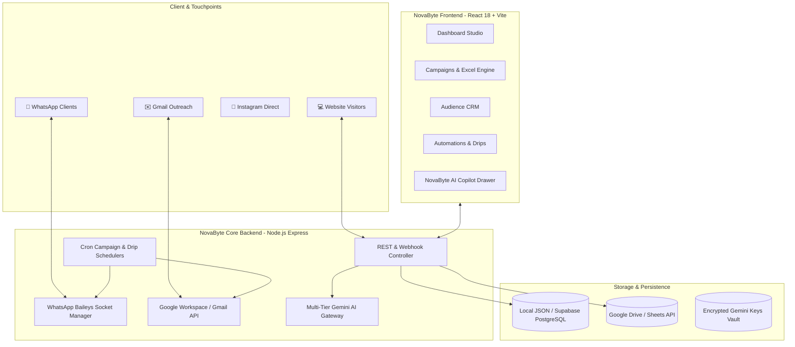

<p align="center">
  
</p>

<h1 align="center">⚡ NovaByte AI Studio</h1>

<p align="center">
  <strong>Enterprise Multi-Channel Autonomous AI Agents, WhatsApp Marketing &amp; Growth Automation SaaS</strong>
</p>

<p align="center">
  <a href="#-architecture--system-design"></a>
  <a href="#-tech-stack"></a>
  <a href="#-whatsapp--email-automation"></a>
  <a href="#-license"></a>
</p>

---

## 📖 Overview

**NovaByte AI Studio** is an all-in-one, enterprise-grade omni-channel automation platform and AI agent builder. It enables software agencies, businesses, and creators to build custom conversational AI agents, connect autonomous WhatsApp customer support via QR pairing, launch bulk multimedia campaigns from Excel spreadsheets, send dynamic Google Workspace/Gmail proposals, nurture leads across multi-step automated email drips, and embed intelligent chat widgets into any website with 1 line of code.

---

## 📑 Table of Contents

- [✨ Key Features](#-key-features)
- [🏛️ Architecture & System Design](#️-architecture--system-design)
- [🛠️ Tech Stack & Infrastructure](#️-tech-stack--infrastructure)
- [🚀 Quick Start & Local Setup](#-quick-start--local-setup)
- [⚙️ Environment Configuration](#️-environment-configuration)
- [📱 WhatsApp & Email Campaigns](#-whatsapp--email-campaigns)
- [🤖 Omni-Channel Lead CRM](#-omni-channel-lead-crm)
- [🌐 Universal Web Embed Widget](#-universal-web-embed-widget)
- [🔌 Google Workspace & Gmail Integration](#-google-workspace--gmail-integration)
- [🗺️ Journey Automation Studio](#️-journey-automation-studio)
- [📚 API Reference](#-api-reference)
- [☁️ Free Cloud Deployment Blueprint](#️-free-cloud-deployment-blueprint)
- [📄 License](#-license)

---

## ✨ Key Features

### 1. 🧠 Multi-Tenant AI Bot Studio & RAG Knowledge Base
- **Custom Agent Creation**: Build and brand unlimited AI agents with custom avatars, system instructions, and theme colors.
- **RAG Knowledge Base**: Upload markdown/text documents, service FAQs, pricing catalogs, and return policies.
- **Human-Grade Conversational Intelligence**: Responds warmly, consultatively, and naturally like an experienced solutions consultant without robotic clichés.
- **Prompt Shield & Guardrails**: Built-in protection against prompt jailbreaks, topic drift, and confidential prompt leaks.

### 2. 📱 Autonomous WhatsApp Growth Engine
- **Baileys QR Engine**: 100% free, unlimited personal/business WhatsApp QR code pairing.
- **24/7 Inbound Qualification**: Automatically answers client inquiries, shares pricing packages, and captures lead contact info.
- **Smart Trigger Keyword Mode**: Auto-responds only to real business inquiries while allowing manual human chat for friends/family.
- **2-Hour AI Follow-Up Engine**: Automatically schedules intelligent conversational follow-ups based on past discussion topics.

### 3. 🚀 Bulk Excel Campaigns & Scheduled Dispatching
- **Dual Audience Modes**:
  - **📁 Excel / CSV Upload**: Auto-detects columns (Phone, Email, Name, Custom Message, Scheduled Date) with live mapping.
  - **✍️ Direct Manual Entry**: Input comma/newline separated numbers or emails directly into the **To:** field.
- **Rich Multimedia Attachments**: Attach Images (`.jpg, .png`), Documents/PDF proposals (`.pdf, .docx`), or Audio/Voice notes (`.mp3, .ogg`).
- **1-Click Sample Templates**: Download pre-formatted `.xlsx` templates directly from the UI.
- **Flexible Timing**: Send immediately or schedule for future timestamps via background cron workers.

### 4. ✉️ Gmail RFC 2822 Outreach & Automated Email Drips
- **Official Google OAuth 2.0 / Workspace Integration**: Sends high-deliverability dynamic proposals directly from your verified Gmail address.
- **Executive Email Formatting**: Sleek branded header, custom styling, and official signature layout.
- **3-Step Automated Nurture Sequences**:
  - *Step 1*: Immediate Welcome & Scope Discovery (`0m delay`)
  - *Step 2*: 24-Hour Portfolio & Interactive Demo Offer (`24h delay`)
  - *Step 3*: 48-Hour Free Strategy Call Invitation (`48h delay`)

### 5. 👥 Omni-Channel Lead CRM & Source Attribution
- **Multi-Channel Source Badges**: Track whether a lead originated from **Website (💻)**, **WhatsApp (📱)**, **Instagram (📸)**, **Email (✉️)**, or **Campaign Broadcasts (🚀)**.
- **Contact Slide-Over Drawer**: Inspect full captured details, requirements, source URLs, and conversation synopses.
- **1-Click Omni-Actions**: Instant *Chat on WhatsApp*, *Send Gmail Proposal*, or *Export to CSV / Sync to Google Sheets*.

### 6. 💬 Interactive NovaByte AI Copilot Drawer
- **Auto-Collapsing Navigation**: Clicking **"Ask NovaByte AI"** in the sidebar automatically collapses the left navigation and slides open the right-side Copilot drawer across any page.
- **Interactive Assistance**: Pre-loaded prompt cards, conversational product help, and step-by-step setup guides with formatted markdown output.

### 7. 🌐 Universal Web Chatbot Widget (<15KB)
- **Zero-Dependency Shadow DOM**: Completely isolated styles that prevent CSS bleed on client sites.
- **1-Click Embed Snippets**: Native code for Plain HTML, React, Next.js, WordPress, Shopify, and Webflow.

---

## 🏛️ Architecture & System Design



---

## 🛠️ Tech Stack & Infrastructure

| Layer | Technology | Purpose |
| :--- | :--- | :--- |
| **Frontend Framework** | React 18 + Vite | Blazing fast client dashboard with sub-second HMR |
| **Styling & Theme** | Vanilla CSS Tokens | Pixel-perfect, responsive, pristine light/dark SaaS aesthetic |
| **Icons & Visuals** | Lucide React | Modern geometric UI icons |
| **Spreadsheets** | SheetJS (`xlsx`) | Client-side spreadsheet generation, parsing & mapping |
| **Backend Runtime** | Node.js (ES Modules) | High-concurrency Express REST API |
| **WhatsApp Engine** | `@whiskeysockets/baileys` | Standalone Web WhatsApp multi-device socket connection |
| **Google Integration** | `googleapis` (OAuth2) | Gmail RFC 2822 sender & Google Sheets live synchronization |
| **AI LLM Gateway** | Google Gemini API (`2.5-flash` / `2.0-flash`) | Contextual RAG, multimodal image analysis & consultative chat |
| **Data Engine** | Dual-Mode (Local JSON + Supabase PostgreSQL) | Zero-setup local development with cloud scale readiness |

---

## 🚀 Quick Start & Local Setup

### Prerequisites
- Node.js (v18.0.0 or higher)
- npm or yarn

### 1. Clone Repository
```bash
git clone https://github.com/sureshdulupolai/AI-Agent-Automation.git
cd AI-Agent-Automation
```

### 2. Backend Setup
```bash
cd backend
npm install
node server.js
```
*Backend runs on `http://localhost:5000` with active local database engine.*

### 3. Frontend Setup
```bash
cd ../frontend
npm install
npm run dev
```
*Frontend opens at `http://localhost:3000`.*

---

## ⚙️ Environment Configuration

Create a `.env` file in `backend/`:

```env
PORT=5000
NODE_ENV=development

# Gemini AI (Optional - UI Key Vault also supported)
GEMINI_API_KEY=your_gemini_api_key_here

# Google OAuth (Gmail & Google Sheets)
GOOGLE_CLIENT_ID=your_google_client_id.apps.googleusercontent.com
GOOGLE_CLIENT_SECRET=your_google_client_secret
GOOGLE_REDIRECT_URI=http://localhost:5000/api/integrations/google/callback

# Database Mode (Set false for zero-setup local JSON)
USE_SUPABASE=false
SUPABASE_URL=https://your-project.supabase.co
SUPABASE_ANON_KEY=your_supabase_anon_key
```

---

## 📱 WhatsApp & Email Campaigns

### Launching an Excel Broadcast:
1. Navigate to **Outreach & Growth > Campaigns & Bulk** (`/campaigns`).
2. Download the sample `.xlsx` template using **"Download Sample Template"**.
3. Fill your audience contact details and upload the file.
4. Verify column mapping (Phone/Email, Name, Custom Message, Schedule Date).
5. Add your image, PDF proposal, or voice note attachment.
6. Click **"Launch Broadcast"** or select **"Schedule for Later"**.

---

## 🤖 Omni-Channel Lead CRM

Leads captured from any channel are automatically categorized:
- 🌐 **All Channels Filter**: Live counter badges across all platforms.
- 📱 **WhatsApp**: Captures incoming phone numbers, sender names, and project requirements.
- 💻 **Website**: Captures email addresses, names, and user queries from embedded widgets.
- 📸 **Instagram**: Attributed with usernames and direct message intents.
- ✉️ **Email**: Attributed with inbound reply addresses and proposal history.

---

## 🌐 Universal Web Embed Widget

Embed the NovaByte AI widget on any website by adding this script before `</body>`:

```html
<script 
  src="https://your-novabyte-domain.com/widget.js" 
  data-bot-id="YOUR_BOT_ID" 
  async>
</script>
```

### React / Next.js Component:
```jsx
import { useEffect } from 'react';

export default function NovaByteWidget() {
  useEffect(() => {
    const script = document.createElement('script');
    script.src = 'https://your-novabyte-domain.com/widget.js';
    script.setAttribute('data-bot-id', 'YOUR_BOT_ID');
    script.async = true;
    document.body.appendChild(script);

    return () => document.body.removeChild(script);
  }, []);

  return null;
}
```

---

## 📚 API Reference

### AI & Bots
- `GET /api/bots` — List all configured AI agents.
- `POST /api/bots` — Create a new AI agent.
- `GET /api/bots/:id` — Get agent details and knowledge base.
- `PUT /api/bots/:id` — Update agent instructions and settings.

### WhatsApp Automation
- `GET /api/whatsapp/:botId/status` — Get live WhatsApp socket status.
- `POST /api/whatsapp/:botId/pair-qr` — Generate QR code for mobile pairing.
- `POST /api/whatsapp/:botId/simulate` — Test incoming simulated chat with multimodal vision.

### Campaigns & Outreach
- `GET /api/campaigns` — List all campaigns and scheduled jobs.
- `POST /api/campaigns/create` — Create immediate or scheduled bulk campaign.
- `POST /api/campaigns/:id/cancel` — Cancel pending scheduled campaign.

### Google Integration & CRM
- `GET /api/integrations` — Check OAuth integration status.
- `POST /api/integrations/google/send-email` — Dispatch RFC 2822 Gmail with attachments.
- `POST /api/integrations/google/sync-sheets` — Sync CRM leads to Google Sheets in 1 click.
- `GET /api/leads` — Fetch omni-channel leads.
- `POST /api/leads` — Manually create lead record.
- `GET /api/leads/export/csv` — Stream CSV download of leads.

---

## ☁️ Free Cloud Deployment Blueprint

Deploy NovaByte AI Studio at **₹0 / $0 monthly cost**:

1. **AI Brain**: Get your free API key at [Google AI Studio](https://aistudio.google.com/).
2. **Backend**: Deploy `backend/` to [Render.com](https://render.com/) as a free Web Service.
3. **Frontend**: Deploy `frontend/` to [Vercel](https://vercel.com/) or [Cloudflare Pages](https://pages.cloudflare.com/).
4. **Database**: Use built-in Local DB or connect [Supabase](https://supabase.com/) free tier (500MB DB).

---

## 📄 License

Distributed under the **MIT License**. See `LICENSE` for more details.

<p align="center">
  Built with ❤️ by <strong>NovaByte AI Studio</strong>
</p>
